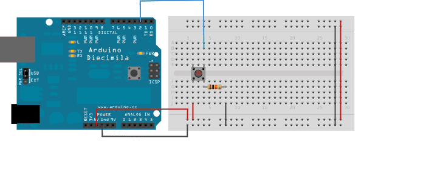

# NeoPixel Snake

Play snake on your LED's. 

 

You need:

* Arduino Uno (or any arduino)

  * Adafruit NeoPixel library
  * CircularBuffer library

* [Adafruit NeoPixel LED matrix](https://www.adafruit.com/product/1487) (8x8 or bigger)

  * The Adafruit matricies often need about 5v2A power to work properly. Since my Arduino can only give a couple of mA power I bought a [mini-USB breakout board](https://www.sparkfun.com/products/9966), 100mf25v capasitor, cable and a USB-to-wall connector.
    * Just check out [this video](https://www.youtube.com/watch?v=j_VvLHZEPZ4)

I just used 4 buttons (digital pins) as controllers. Not very user-friendly, but it works.

 

